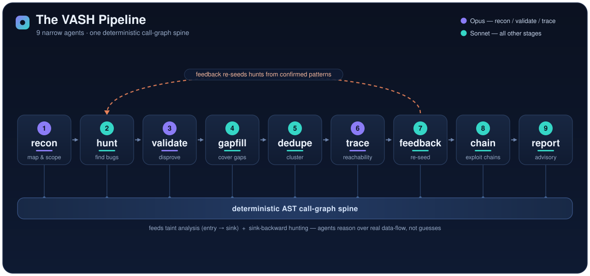

<div align="center">

# 🛡️ VASH — Vanguard Agentic Security Harness

**A static-first, agentic vulnerability scanner that hunts broadly — then, in its sandbox, _proves_ findings by running a real exploit instead of just flagging what looks vulnerable.**

[](#-license)
[](#-install)
[](#-project-structure)
[](https://www.anthropic.com)
[](#-static-vs-dynamic-validation)

</div>

---

VASH finds real, reachable vulnerabilities in source code — and its findings aren't guesses. Where most LLM scanners stop at *"this looks exploitable,"* VASH goes one step further: it **writes and executes a proof-of-concept for every candidate inside an isolated sandbox** and keeps only the ones that actually fire. That single mechanism — *static recall plus sandboxed executed-PoC confirmation* — is what separates it from every static-only agent.

It is built on a battle-tested foundation ([evilsocket/audit](https://github.com/evilsocket/audit)) and grafts the strongest ideas from [Capital One VulnHunter](https://github.com/capitalone/VulnHunter) and [Visa VVAH](https://github.com/visa/visa-vulnerability-agentic-harness) — see [Attribution](#-attribution). It runs on your **Claude Pro/Max subscription** through the official Claude Code Agent SDK; no API key required.

```bash
vash run --repo ./my-project                       # static analysis (safe by default)
vash run --repo ./my-project --dynamic-validation  # + sandboxed executed-PoC confirmation
```

## 📖 Table of contents

- [Why VASH](#-why-vash) · [Highlights](#-highlights) · [How it works](#-how-it-works) · [Install](#-install) · [Quickstart](#-quickstart)
- [Commands](#-commands) · [The report](#-the-report) · [Static vs dynamic](#-static-vs-dynamic-validation) · [Project structure](#-project-structure)
- [Configuration & cost](#-configuration--cost) · [Results](#-results) · [Attribution](#-attribution) · [License](#-license)

---

## 🎯 Why VASH

A single "find bugs in this code" prompt produces noise. VASH instead runs a disciplined pipeline modeled on Cloudflare's *Project Glasswing* research:

| Principle | What VASH does |
|---|---|
| **Many narrow agents** | Each hunter chases *one* attack class in *one* scoped location — not one exhaustive agent. |
| **Deliberate disagreement** | A differently-modeled Validate agent adversarially tries to **disprove** every finding by re-reading the code. |
| **Reachability as the gate** | A Trace stage proves an attacker-controlled input can actually reach the sink — unreachable "bugs" are dropped. |
| **Feedback loops** | A confirmed pattern in one file automatically seeds hunts for the same pattern everywhere else. |
| **Executed-PoC confirmation** | *VASH's differentiator.* In dynamic mode it runs a real exploit per candidate in a sandbox and keeps only what fires — every delivered finding is exploit-verified, not statically guessed. |

## ✨ Highlights

- 🧠 **9-stage agentic pipeline** — recon → hunt → validate → gapfill → dedupe → trace → feedback → chain → report, over a deterministic AST **call-graph spine**.
- 🎯 **Executed-PoC confirmation** — opt-in `--dynamic-validation` runs each PoC in an isolated sandbox; on a bare host VASH stays **100% static** and never executes untrusted code.
- 🌐 **Multi-language** — Python, JavaScript/TypeScript, Go, Java, Ruby, PHP, C/C++, and more, plus web templates (Jinja/EJS/Handlebars…) and IaC.
- 🔗 **Exploit-chain synthesis** — stitches individual findings into end-to-end attack chains.
- 📊 **Professional reporting** — a detailed, advisory-grade Markdown report (threat model, CVSS + vectors, exploit scenarios, adversarial-verification verdicts, and paste-ready GitHub-Security-Advisory blocks) alongside a machine-readable `report.json`.
- 📟 **Rich live logging** — per-stage progress, running cost, and a per-finding confirmation feed; degrades to clean plain lines when run detached.
- 🛠️ **Decoupled commands** — `run` (scan), `remediate` (static patches), `validate` (independent second opinion).
- 💳 **Subscription-native** — driven by Claude Pro/Max via the Agent SDK; optional metered API-key and OpenRouter/gateway support.

## 🔍 How it works

VASH maps the repository into a call-graph, fans out many narrowly-scoped hunters, adversarially validates each finding, proves reachability, and (optionally) confirms by execution — then writes the report.

<p align="center">
  
</p>

| # | Stage | Tier | Purpose |
|---|---|---|---|
| 1 | **Recon** | Opus | Map the repo; emit narrowly-scoped hunt tasks + a completeness inventory of every untrusted input. |
| 2 | **Hunt** | Sonnet | One attack class per agent; hunts statically, then (dynamic mode) executes a PoC to confirm. |
| 3 | **Validate** | Opus | Adversarial re-read on a *different* model — tries to **disprove** each finding. |
| 4 | **Gapfill** | Sonnet | Re-queue under-covered areas until coverage is complete. |
| 5 | **Dedupe** | Sonnet | Cluster findings by root cause; keep one canonical per distinct file. |
| 6 | **Trace** | Opus | Prove attacker-controlled input reaches the sink (reachability gate). |
| 7 | **Feedback** | Sonnet | Seed fresh hunts from confirmed patterns; re-run the loop. |
| 8 | **Chain** | Sonnet | Synthesize multi-finding exploit chains. |
| 9 | **Report** | Sonnet | Emit `report.json` (raw) + a detailed `report.md` (advisory-grade). |

> A deterministic **graphify** call-graph feeds taint analysis (entry → sink) and sink-backward hunting, so agents reason over real data-flow, not guesses. Models are per-stage configurable.

## 📦 Install

**Requirements:** Python 3.11+, Node.js (for the bundled Claude CLI), and a Claude Pro/Max subscription (or an Anthropic API key).

```bash
git clone https://github.com/0xsharz/vanguard-agentic-security-harness.git
cd vanguard-agentic-security-harness
python -m venv .venv && source .venv/bin/activate
pip install -e .

# Authenticate (uses your Claude subscription — no API key needed)
claude login
vash auth-check
```

## 🚀 Quickstart

```bash
# 1. Scan a repo (static — safe by default)
vash run --repo ./target-project --run-id my-first-scan

# 2. Read the report
vash report --run-id my-first-scan --format md    # detailed Markdown
#   raw JSON + report.md are also written under results/<run-id>/report/

# 3. (optional) Confirm findings by execution, inside a sandbox
docker build -t vash:latest .
./scripts/run-in-docker.sh ./target-project my-scan-dyn   # runs with --dynamic-validation

# 4. (optional, decoupled) generate patches / a second opinion
vash remediate --run-id my-first-scan
vash validate  --run-id my-first-scan
```

## 🖥️ Commands

### `vash run` — the scan

```bash
vash run --repo PATH [options]
```

| Flag | Description |
|---|---|
| `--repo PATH` | **(required)** Path to the target source repo. |
| `--run-id TEXT` | Run identifier (default: random). Reuse with `--resume`. |
| `--resume` | Resume an existing run — re-queues interrupted/failed tasks. |
| `--dynamic-validation` | **Enable the executed-PoC (sandboxed) validation stage.** Default is static-only. Requires a sandbox (`Docker`/`VASH_SANDBOX=1`) or `--dangerously-no-sandbox`. |
| `--dangerously-no-sandbox` | DEV ONLY — allow `--dynamic-validation` to run PoCs without a sandbox, with a loud warning. Never use on untrusted targets. |
| `--max-cost-usd FLOAT` | Abort if cumulative cost crosses this threshold. |
| `--max-concurrency INT` | Cap every stage's concurrency (cost/rate containment). |
| `--max-recon-tasks INT` | Cap the number of initial hunt tasks recon may emit. |
| `--target-url URL` | Optional live deployment the agents may hit to confirm findings. |
| `--target-creds K=V` | Credentials for the live target (repeatable). |
| `--scope-notes FILE` | Target-specific scope rules / exclusions, passed to every stage. |
| `--config PATH` | Override `config/stages.yaml` (models, concurrency, iterations). |
| `--allow-api-key` | Honor `ANTHROPIC_API_KEY` for metered billing. |

### `vash report` — read the results

```bash
vash report --run-id ID --format md     # detailed advisory-grade Markdown
vash report --run-id ID --format json   # raw machine-readable report
```

### `vash remediate` — static patch generation *(decoupled, opt-in)*

Generates policy-gated, root-cause patches (unified diffs) for the confirmed findings by *reading* the code — it never executes the target.

```bash
vash remediate --run-id ID [--repo PATH] [--policy FILE] [--out DIR] [--verify]
```

### `vash validate` — independent second opinion *(decoupled, opt-in)*

Re-verifies a prior run's confirmed findings with a fresh, adversarial pass.

```bash
vash validate --run-id ID [--repo PATH] [--model NAME] [--min-confidence FLOAT]
```

### `vash status` / `vash auth-check`

```bash
vash status --run-id ID       # tasks, findings, traces, cost
vash auth-check               # verify Claude Code auth is configured
```

## 📄 The report

Every run writes a raw, machine-readable **`report.json`** and a detailed, advisory-grade **`report.md`**. The Markdown report is deterministic and structured like a professional pentest deliverable:

- **Summary** & severity tally
- **Scan Metrics** — files in scope/analyzed, coverage %, cost, tokens-by-phase
- **Threat Model** — system context, assets, trust boundaries, ranked threats, open questions
- **Verification** — raw findings → true/false positives, duplicates collapsed, precision
- **Findings** — each with CWE (+ MITRE link), **CVSS 3.1 score & vector**, confidence, "Also at" co-located sites, Description / Impact / **Exploit scenario** / Preconditions / evidence / **How to fix** / **Adversarial-verification verdict**
- **GHSA advisory sub-block** per finding — Summary / Details / Proof of Concept / Weaknesses / References, ready to paste into a GitHub Security Advisory
- **Exploit chains** — end-to-end attack paths across findings

## 🔒 Static vs dynamic validation

VASH is **static-first**. Its core safety invariant is enforced in one place: the agent runner strips the `Bash` tool — so **nothing from the target ever executes** — unless dynamic validation is explicitly enabled *and* an isolation sandbox is active.

```
execution_enabled = --dynamic-validation  AND  (inside a sandbox  OR  --dangerously-no-sandbox)
```

| Mode | Command | Behavior |
|---|---|---|
| **Static** (default) | `vash run --repo …` | Pure reasoning + call-graph taint. Never runs target code — safe on untrusted repos. |
| **Dynamic** | `vash run --repo … --dynamic-validation` *(in Docker/`VASH_SANDBOX=1`)* | Writes & runs a real PoC per candidate in the sandbox; keeps only what fires. |
| **Refused** | `--dynamic-validation` on a bare host | **Fails fast** with a clear remedy — never silently executes on the host. |

## 🗂️ Project structure

```
vash/
├── vash/                    # the package
│   ├── cli.py               # Click CLI entry point
│   ├── orchestrator.py      # pipeline driver (the 9 stages)
│   ├── runner.py            # agent runner + the Bash safety gate
│   ├── sandbox.py           # execution sandbox gate (static-first invariant)
│   ├── progress.py          # RunReporter — rich, fail-soft live logging
│   ├── taint.py             # deterministic entry→sink taint analysis
│   ├── graph_context.py     # call-graph queries feeding the hunters
│   ├── state.py             # SQLite run state (findings, tasks, cost)
│   ├── stages/              # recon, hunt, validate, gapfill, dedupe,
│   │                        #   trace, feedback, chain, report, remediate
│   └── reporting/markdown.py# VVAH/GHSA-style report renderer
├── prompts/                 # one system prompt per stage
├── schemas/                 # JSON Schemas — every agent output is validated
├── config/stages.yaml       # per-stage model, concurrency, iterations
├── bench/                   # CVE-recall benchmark harness + ground truth
├── scripts/run-in-docker.sh # sandboxed (executed-PoC) runner
├── tests/                   # 660 offline tests
├── Dockerfile               # the isolation sandbox image
├── NOTICE / THIRD_PARTY_LICENSES.md   # attribution
└── docs/                    # design specs & benchmark write-ups
```

## ⚙️ Configuration & cost

- **Models** are per-stage in `config/stages.yaml` (Opus for recon/validate/trace, Sonnet elsewhere by default) — tune cost vs depth freely.
- **Containment:** `--max-cost-usd` (hard budget ceiling), `--max-concurrency`, and `--max-recon-tasks` bound every run; runs are **resumable** (`--resume`) after an interruption or budget stop.
- **Providers:** subscription by default; `--allow-api-key`/`ANTHROPIC_API_KEY` for metered billing, or an OpenRouter/gateway base-URL for non-Anthropic models.

## 📈 Results

### 🎯 `swagger-typescript-api` ≤ 13.12.1 — blind scan recovered **all 6 disclosed CVEs (100%)**

Given only the source — no hints, no advisories — VASH independently surfaced confirmed findings corresponding to **every one of the six CVEs** later disclosed in `swagger-typescript-api` and fixed in **13.12.2**. Each survived VASH's adversarial validation stage. All six share one root cause: attacker-controlled OpenAPI spec content reaching code-generation sinks without TypeScript-context escaping.

| Disclosed CVE | Class | VASH |
|---|---|:---:|
| [CVE-2026-54662](https://github.com/advisories/GHSA-hqj5-cw9f-rx67) | RCE — `fetch` client `baseUrl` | ✅ |
| [CVE-2026-54661](https://github.com/advisories/GHSA-38c3-wv3c-v3xj) | RCE — `axios` client `baseUrl` | ✅ |
| [CVE-2026-54666](https://github.com/advisories/GHSA-w284-33mx-6g9v) | RCE — OpenAPI path template | ✅ |
| [CVE-2026-54664](https://github.com/advisories/GHSA-5f94-x226-ccpm) | RCE — enum string values | ✅ |
| [CVE-2026-54660](https://github.com/advisories/GHSA-h754-fxp7-88wx) | Credential exfiltration — remote `$ref` | ✅ |
| [CVE-2026-54663](https://github.com/advisories/GHSA-x36r-4347-pm5x) | SSRF — remote `$ref` | ✅ |

VASH surfaced **29 findings; 12 survived adversarial validation** — the six above plus additional plausibly-novel issues (prototype pollution, ReDoS, YAML deserialization, path traversal). *Recall is mapped by vulnerability sink/class against the disclosed advisories.*

### 📊 `datamodel-code-generator` 0.55.0 — head-to-head vs VVAH & audit

Deterministically scored by the `bench/` harness against published CVE ground truth (50 Python files + 20 Jinja2 templates, **11 in-version CVEs**):

| Tool / run | Delivered recall | Findings | Cost / time | Basis |
|---|:---:|:---:|---|---|
| 🥇 **VASH** (Docker, executed-PoC) | **5/11 (45%)** | 25 (+3 chains) | ~$88 / ~3.5 hr | every finding exploit-verified |
| 🥇 **VASH** (host, static) | **5/11 (45%)** | 25 (+5 chains) | ~$103 / ~2.5 hr | static hunt |
| 🥈 Visa **VVAH** | 4/11 (36%) | 20 (+6 chains) | ~7.2M tok / ~3 hr | static |
| 🥉 evilsocket **audit** | 2/11 (18%) | 13 | ~$48 / ~2.9 hr | static |

- **5/11 per run, 6/11 union.** Two independent runs each delivered 5/11; across both, VASH covered **6 distinct CVEs**. The hunt is stochastic — a given run trades one codegen CVE for another — so added iterations reliably land 6/11.
- **Templates are the decisive edge.** VASH uniquely delivered `CVE-2026-54654`, a `.jinja2` codegen bug no other tool caught, and matched VVAH on the other template CVE.
- **Executed-PoC buys confidence.** In the Docker run, every one of the 25 delivered findings had a PoC that fired in the sandbox — confirmation by execution, the axis on which VASH is categorically different from static-only agents.

*Reproducible via the `bench/` harness and its CVE ground truth. See [`docs/BENCHMARK-COMPARISON.md`](docs/BENCHMARK-COMPARISON.md) for the per-CVE matrix and caveats.*

## 🙏 Attribution

VASH stands on excellent open-source work and preserves full attribution (see [`NOTICE`](NOTICE) and [`THIRD_PARTY_LICENSES.md`](THIRD_PARTY_LICENSES.md)):

- **[evilsocket/audit](https://github.com/evilsocket/audit)** (MIT) — the base 8-stage pipeline, prompts, schemas, and orchestrator VASH forks and extends.
- **[Capital One VulnHunter](https://github.com/capitalone/VulnHunter)** (Apache-2.0) — completeness/coverage and disprove-gate mechanisms.
- **[Visa VVAH](https://github.com/visa/visa-vulnerability-agentic-harness)** (Apache-2.0) — template-file scanning and clean report delivery.
- Architecture inspired by Cloudflare's **[Project Glasswing](https://blog.cloudflare.com/cyber-frontier-models/)** research.

## 📜 License

VASH is released under the **MIT License** (inherited from evilsocket/audit), with Apache-2.0 components attributed in [`THIRD_PARTY_LICENSES.md`](THIRD_PARTY_LICENSES.md). See [`LICENSE`](LICENSE).

## ⚠️ Responsible use

VASH is a defensive security tool for **authorized** testing of code you own or are permitted to assess. Dynamic mode executes proof-of-concept exploits — run it only inside the provided sandbox, and never point it at systems you don't have permission to test.

---

<div align="center">
<sub>Built with the Claude Agent SDK · static-first by design · executed-PoC by choice</sub>
</div>
